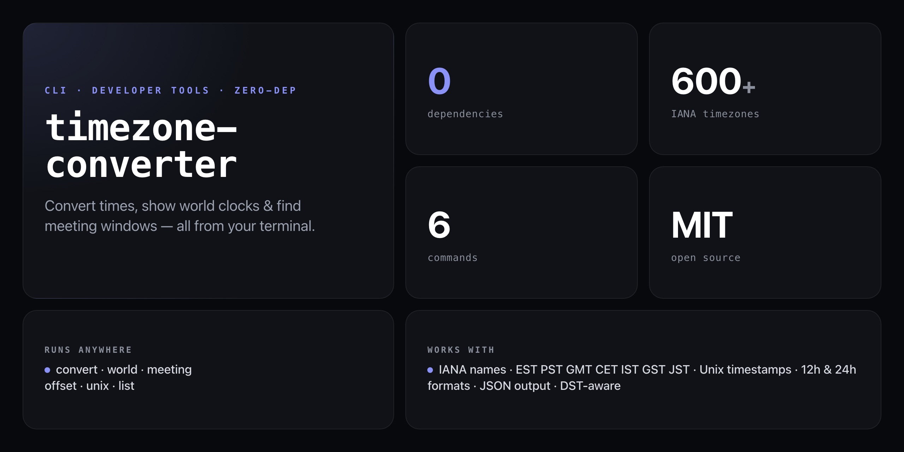

<div align="center">

**Zero-dependency timezone CLI. Convert times, show world clocks, and find meeting windows — all from Node's built-in `Intl` API.**


</div>

---

Distributed teams live across timezone boundaries. `timezone-converter` (`tzc`) is a single-file CLI that converts times, shows a live world clock, finds overlapping business hours, and decodes Unix timestamps — with zero npm dependencies and full DST awareness.

```
$ tzc "2pm" --from EST --to Asia/Dubai

  Time Conversion
  ──────────────────────────────────────────────────
  America/New_York             Thu, Jun 18, 2:00 PM
  UTC-05:00                    Standard time

  ↓ converted to

  Asia/Dubai                   Thu, Jun 18, 11:00 PM
  UTC+04:00                    Standard time
```

## Install

No npm account needed — runs straight from GitHub:

```bash
npx github:NickCirv/timezone-converter
```

Or install globally:

```bash
npm install -g github:NickCirv/timezone-converter
tzc --help
```

Both `tzc` and `timezone-converter` are available as bin aliases.

## Commands

### Convert a time

```bash
tzc "2pm" --from EST --to Asia/Dubai
tzc "14:30" --from America/New_York --to Europe/London
tzc now --from PST --to IST
tzc "9am" --from GMT --to JST
```

### World clock

```bash
tzc world --zones "America/New_York,Europe/London,Asia/Dubai,Asia/Tokyo"

  World Clock    (as of 2026-06-18T10:00:00.000Z)
  ────────────────────────────────────────────────────────────
  America/New_York               06:00:00 AM   UTC-04:00  ⟳DST
  Europe/London                  11:00:00 AM   UTC+01:00  ⟳DST
  Asia/Dubai                     02:00:00 PM   UTC+04:00
  Asia/Tokyo                     07:00:00 PM   UTC+09:00
```

### Find meeting windows

```bash
tzc meeting --zones "America/New_York,Europe/London"
tzc meeting --zones "EST,GMT,IST" --work-start 8 --work-end 17

  Meeting Time Finder
  Business hours: 9:00 – 18:00 local in each zone
  ──────────────────────────────────────────────────────────────────────
  UTC Time    America/New_York          Europe/London
  ──────────────────────────────────────────────────────────────────────
  02:00 PM    10:00 AM                  03:00 PM
  02:30 PM    10:30 AM                  03:30 PM
  03:00 PM    11:00 AM                  04:00 PM
```

### List timezones

```bash
tzc list               # all 600+ IANA zones
tzc list America       # filter by name
tzc list Asia
```

### UTC offset

```bash
tzc offset Asia/Dubai

  Asia/Dubai
  Offset : UTC+04:00
  DST    : Not active
```

### Unix timestamp conversion

```bash
tzc unix 1700000000 --zone Asia/Dubai

  Unix: 1700000000
  Zone: Asia/Dubai
  Time: Wed, Nov 15, 2:13:20 AM   UTC+04:00
  ISO:  2023-11-14T22:13:20.000Z
```

## Flags

| Flag | Short | Description |
|------|-------|-------------|
| `--from` | `-f` | Source timezone (alias or IANA name) |
| `--to` | `-t` | Target timezone (alias or IANA name) |
| `--zones` | `-z` | Comma-separated timezone list |
| `--zone` | | Single timezone for `offset` / `unix` commands |
| `--work-start` | | Business day start hour (default: `9`) |
| `--work-end` | | Business day end hour (default: `18`) |
| `--json` | | Output as JSON (all commands support this) |
| `--no-color` | | Disable ANSI colours |
| `--help` | `-h` | Show help |

## JSON output

Every command supports `--json` for scripting and piping:

```bash
tzc "2pm" --from EST --to Asia/Dubai --json
```

```json
{
  "input": "2pm",
  "from": {
    "timezone": "America/New_York",
    "time": "Thu, Jun 18, 2:00 PM",
    "offset": "UTC-05:00",
    "dst": false
  },
  "to": {
    "timezone": "Asia/Dubai",
    "time": "Thu, Jun 18, 11:00 PM",
    "offset": "UTC+04:00",
    "dst": false
  },
  "unix": 1750258800
}
```

## Timezone aliases

Common abbreviations resolve to their IANA equivalents:

| Alias | Resolves to |
|-------|-------------|
| `EST` / `EDT` | America/New_York |
| `PST` / `PDT` | America/Los_Angeles |
| `CST` / `CDT` | America/Chicago |
| `MST` / `MDT` | America/Denver |
| `GMT` | Europe/London |
| `UTC` | UTC |
| `CET` / `CEST` | Europe/Paris |
| `EET` / `EEST` | Europe/Helsinki |
| `IST` | Asia/Kolkata |
| `GST` | Asia/Dubai |
| `JST` | Asia/Tokyo |
| `KST` | Asia/Seoul |
| `AEST` / `AEDT` | Australia/Sydney |
| `NZST` / `NZDT` | Pacific/Auckland |
| `SAST` | Africa/Johannesburg |
| `HST` | Pacific/Honolulu |
| `AKST` / `AKDT` | America/Anchorage |

Run `tzc list` for all 600+ IANA zone names.

## Time input formats

| Format | Example |
|--------|---------|
| 12-hour | `2pm`, `2:30pm` |
| 24-hour | `14:30`, `14` |
| Natural | `now` |
| Unix 10-digit | `1700000000` |
| Unix 13-digit ms | `1700000000000` |

## What it is NOT

- **Not a scheduling app.** `tzc meeting` finds overlapping business hours — it doesn't create calendar invites or send notifications.
- **Not a time-series database.** It works on instants, not ranges. For recurring schedule analysis, use a purpose-built tool.
- **Not a replacement for full Intl polyfills.** It requires Node 18+ and relies on the runtime's IANA timezone data; very old Node versions or stripped environments may have incomplete zone databases.

---

<div align="center">
<sub>Zero dependencies · Node 18+ · MIT · by <a href="https://github.com/NickCirv">NickCirv</a></sub>
</div>
